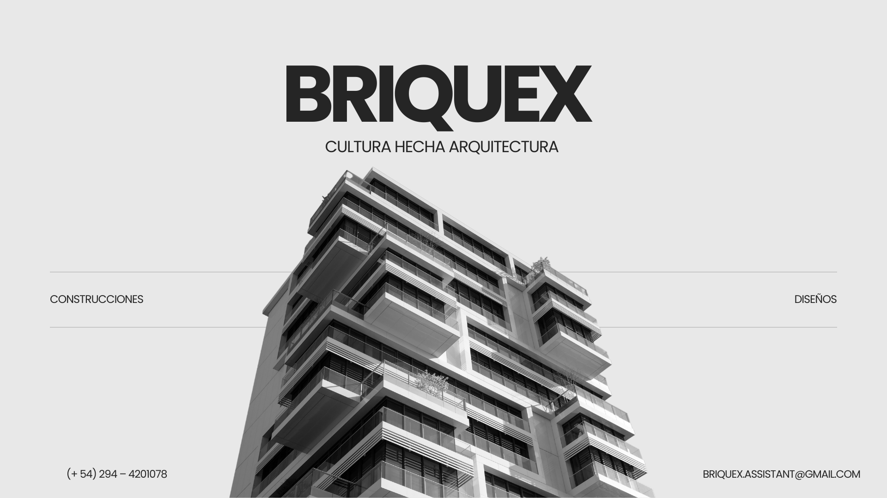

## Repositorio oficial de **Briquex**, estudio de arquitectura y constructora.

Este espacio centraliza el desarrollo, mantenimiento y documentación de los proyectos tecnológicos de la empresa, incluyendo la web institucional y futuras herramientas digitales.

## Objetivo

El objetivo de esta organización es:

- Mantener el código de la empresa de forma ordenada y profesional
- Facilitar el trabajo colaborativo entre desarrollo, diseño y otros equipos
- Centralizar documentación técnica y decisiones de arquitectura
- Garantizar buenas prácticas, control de versiones y escalabilidad

## Organización del código

- Repositorios separados por proyecto
- Ramas protegidas
- Commits claros y descriptivos
- Documentación mínima obligatoria por proyecto

## Accesos y roles

- La organización es administrada por el equipo técnico
- Los accesos se otorgan según el rol y necesidad
- Los repositorios pueden ser públicos o privados según el caso

## Contacto

Para consultas técnicas o relacionadas con los proyectos:

- Organización: Briquex Company
- Equipo de desarrollo interno
